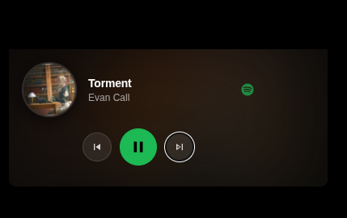

# The following widgets in this repo are:
-[clock widget]
2-Pixel day progress
3-Spotify widget
4-System resources

Out of the 4 widgets the Clock and the Pixel day widget should work out of the box, the other 2 require some amount of set up.

**Spotify Widget** 

